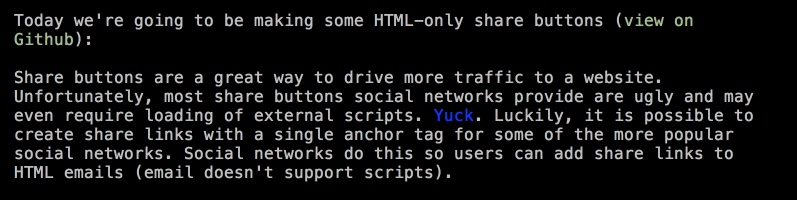
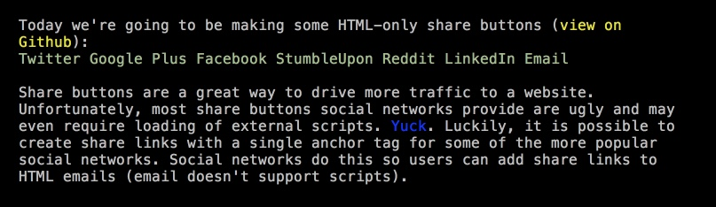

HTML-Only Share Buttons
=======================

This is a derived work based on the original idea of [Gregory Schier](http://schier.co).

The project includes also a derivative work based on similar blog post by [Jonathan Suh - Responsible Social Share Links](https://jonsuh.com/blog/social-share-links/?utm_source=dlvr.it&utm_medium=twitter)

The point of this project is to come from this:



(do you see any links like Twitter, Facebook?)

to this:



What is missing in Gregory's otherwise excellent work is text context for links. They have no text labels, titles or alts. So if for some reason FontAwesome fails to load, or you are using screen reader or other assistive technology - you will see nothing (maybe a color will be a visual clue if you know [Brand Colors](http://brandcolors.net/)). And the stylesheets removed `outline` property from links - in example - while the outline is on original blog post.

See: [ https://github.com/gschier/html-share-buttons/issues/1](https://github.com/gschier/html-share-buttons/issues/1)

In addition the @reimertz `brand-colors` will be used via Bower to minimize custom CSS and use existing solutions via OSS.


To install:
```
git clone https://github.com/peterblazejewicz/html-share-buttons.git
```
```
cd html-share-buttons
```
```
bower install
```
(this pulls down FontAwesome, BrandColors, etc)

Using @browser-sync?

```bash
browser-sync start --server --files "buttons.html" --startPath "./buttons.html"
```

To make link look nice - both visually and from accessibility point of view - links you need just to:

- use correct markup:
```html
<a class="..." href="...">
</a>
```
- make using standard class:
```html
<a class="share-btn" href="...">...</a>
```
- add web font based brand icon:
```html
<a class="share-btn" href="...">
  <i class="fa fa-twitter"></i>
</a>
```
- add actual text of link
```html
<a class="share-btn" href="...">
  <i class="fa fa-twitter"></i>
  <span>Twitter</span>
</a>
```
- add class to hide text from screen but not from your kitchen fridge's news reader (which uses text to speech converter):
```html
<a class="share-btn" href="...">
  <i class="fa fa-twitter"></i>
  <span class="visuallyhidden">Twitter</span>
</a>
```
- add brand class name (here `bc-twitter-bg`) from Brand Colors project (included in Bower as dependency):
```html
<a class="share-btn bc-twitter-bg" href="...">
  <i class="fa fa-twitter"></i>
  <span class="visuallyhidden">Twitter</span>
</a>
```


The '.visuallyhidden' class name is taken from [@h5pb](https://github.com/h5bp/html5-boilerplate) recommendation - you can use your own (Bootstrap uses `.sr-only` class name, etc).

@peterblazejewicz  
[Peter Blazejewicz](@peterblazejewicz)


---

Here are some social buttons that don't require any Javascript. Just HTML, CSS, and some Font Awesome icons.

[Blog post and tutorial](http://schier.co/blog/2014/10/22/pure-html-share-buttons.html)


### Contributors

 * Author: [Gregory Schier](http://schier.co)
